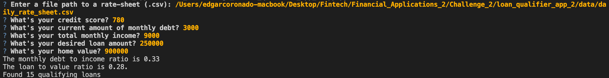
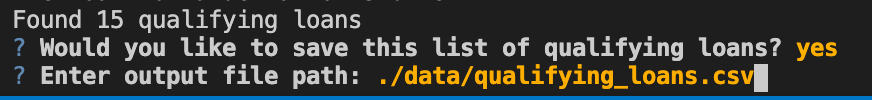

# Loan Qualifier Application

This is a python command-line interface application that allows users to see a list of qualifying loans from various lenders, and be able to save such list. The application works by that taking in a `daily_rate_sheet` of loan criteria from various loan providers, asks the user a number of questions to evaluate their loan eligibility, and then returns to them a list of qualifying loans. If the user would like to save the list of qualifying loans into a `qualifying_loans.csv`, the application asks the user for the output file path.

---

## Technologies

This project leverages python 3.7 with the following packages:

* [fire](https://github.com/google/python-fire) - For the command line interface, help page, and entrypoint.

* [questionary](https://github.com/tmbo/questionary) - For interactive user prompts and dialogs

* [pytest](https://docs.pytest.org/en/stable/) - For basic assertion testing of financial calculators and filters, and filio.

---

## Installation Guide

Before running the application first install the following dependencies.

```python
  pip install fire
  pip install questionary
  pip install pytest
```

---

## Usage

To use the loan qualifier application simply clone the repository and run the **app.py** with:

```python
python app.py
```

Upon launching the loan qualifier application you will be greeted with the following prompts.



You will then be asked if you wish to save the list of the qualifying loans. If you reply 'yes', you will see the outcome below. 



If you choose not to save, you will see the following message. 


---

## Contributors

Brought to you by Edgar Coronado

---

## License

MIT